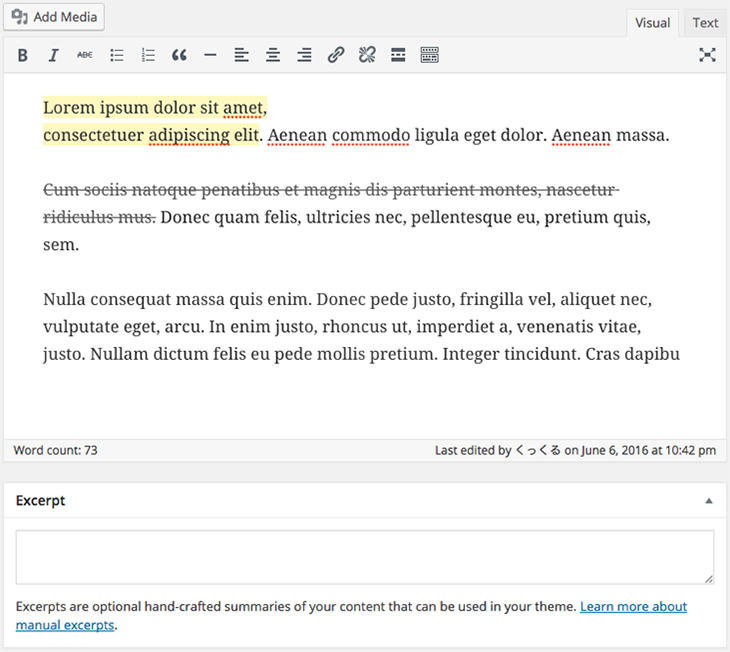

VA Excerpt From Content
==============================

Automatically create the excerpt from content.

[](https://travis-ci.org/visualive/va-excerpt-from-content)

## Description

You don't need to enter an excerpt. Plug-ins auto-create excerpt from the content.

* Is the number of characters set in the "excerpt_length" filter.
* "Continue reading" setting in the "excerpt_more" filter.
* If there is "<!--more-->" does not create an excerpt.
* remove the html and "va_excerpt_from_content_strip_all_tags" filter to true.

```
add_filter( 'va_excerpt_from_content_strip_all_tags', '__return_true' );
```

## Requires

* WordPress 4.5 or higher
* PHP 5.6+  

## Installation

To install "VA Excerpt From Content":

1. Upload the "va-excerpt-from-content" directory and all its contents to your `/wp-content/plugins/` directory.
2. Activate the plugin through the 'Plugins' menu in WordPress.

## Screenshots

### You don't need to enter an excerpt.
  

### Plug-ins auto-create excerpt from the content.
  

## Changelog

### 1.0.0
* First public release
